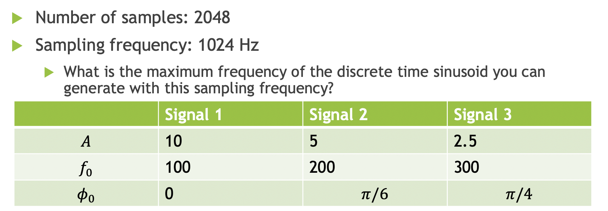

# Lab 2

**Author:** Miriam Ramos Arevalo  
**Date:** October 2026

I divided the lab in 3 parts:

1. **Slide 1 — Nyquist sampling:** Use the eight Lab 1 signals. Find each signal's highest instantaneous frequency, then sample at the Nyquist rate, twice that rate, and ten times that rate. Plot the signals and their FFT magnitudes.
2. **Slides 2–4 — Filtering:** Add the 3 sinusoids with the given parameters. Create low-pass, band-pass, and high-pass filters to keep one signal in each. Plot the original signal's periodogram and the 3 filtered periodograms.
3. **Slide 5 — Time frequency analysis:** Generate the eight Lab 1 signals at a specific sampling rate and make their spectrograms.

## Output

1. **Part 1 — `sampling.py`:** [output/sampling/](output/sampling/), one figure per signal. Each figure has three rows for the three sampling rates. The left column shows signal value vs time, the right column shows FFT magnitude vs frequency.
2. **Part 2 — `filtering.py`:** [output/filtering/filtering.png](output/filtering/filtering.png), one figure with four rows. These show the original signal and the 3 filtered signals, keeping 100, 200, and 300 Hz respectively.
3. **Part 3 — `spectrograms.py`:** [output/spectrograms/](output/spectrograms/), one figure per signal. Time is on the x-axis, frequency is on the y-axis, d brighter colors show stronger frequency components.

## Files and how to run

- `signals.py`: the original signal functions from Lab 1.
- `sampling.py`: Part 1 sampling calculations and plots.
- `filtering.py`: Part 2 signal generation, filters, and periodograms.
- `spectrograms.py`: Part 3 spectrograms.
- `run.py`: runs all 3 parts above in order.

From the Lab 2 folder, run:

```bash
python3 run.py
```

## Part 1 — `sampling.py`: Nyquist sampling

### 1. Use the original signals

We use the same functions and parameters from Lab 1's `signals.py`, from **0 to 1 second**.

For example, the quadratic chirp is:

$$
s(t)=10\sin\left[2\pi(10t+3t^2+3t^3)\right].
$$

Here, $t$ is time in seconds, $s(t)$ is the signal value, and 10 is the amplitude.

### 2. Find the highest instantaneous frequency

Instantaneous frequency tells us how fast the signal oscillates at a particular time.
For a signal written as $s(t)=A(t)\sin[2\pi p(t)+\phi_0]$, $p(t)$ is the phase in cycles. Take its derivative:

$$
f(t)=\frac{dp(t)}{dt}.
$$

For the quadratic chirp:

$$
p(t)=10t+3t^2+3t^3.
$$

Taking the derivative with respect to $t$ gives:

$$
f(t)=10+6t+9t^2.
$$

This increases over our 1 second interval, so its highest value is at $t=1$:

$$
f_{\max}=f(1)=10+6+9=25\text{ Hz}.
$$

The other Lab 1 signals give:

| Signal |  Equation $s(t)$ | Instantaneous frequency $f(t)$ | $f_{\max}$ (Hz) |
| --- | --- | --- | --- |
| Sinusoid | $\sin(2\pi\,7t)$ | $7$ | 7 |
| Linear chirp | $\sin[2\pi(2t+4t^2)]$ | $2+8t$ | 10 |
| Sine-Gaussian | $e^{-(t-0.5)^2/[2(0.1)^2]}\sin(2\pi\,15t)$ | $15$ | 15 |
| FM | $\sin[2\pi\,10t+2\cos(4\pi t)]$ | $10-4\sin(4\pi t)$ | 14 |
| AM | $\cos(4\pi t)\sin(2\pi\,15t)$ | $15$ | 15 |
| AM-FM | $\cos(4\pi t)\sin[2\pi\,15t+2\cos(4\pi t)]$ | $15-4\sin(4\pi t)$ | 19 |
| Transient chirp | $\sin[2\pi(3u+6u^2)]$, where $u=t-0.25$ | $3+12u$ | 9 |

_Note:_ The transient chirp is active from **0.25 to 0.75 seconds** and is zero elsewhere.

### 3. Choose the 3 sampling rates

Using $f_{\max}$, the highest instantaneous frequency during our interval:

$$
\begin{aligned}
\text{Nyquist rate:}\quad &f_s=2f_{\max},\\
\text{Twice the Nyquist rate:}\quad &f_s=4f_{\max},\\
\text{Ten times the Nyquist rate:}\quad &f_s=20f_{\max}.
\end{aligned}
$$

| Signal | Nyquist rate | 2 x Nyquist rate | 10 x Nyquist rate |
| --- | --- | --- | --- |
| Quadratic chirp | 50 Hz | 100 Hz | 500 Hz |
| Sinusoid | 14 Hz | 28 Hz | 140 Hz |
| Linear chirp | 20 Hz | 40 Hz | 200 Hz |
| Sine-Gaussian | 30 Hz | 60 Hz | 300 Hz |
| FM | 28 Hz | 56 Hz | 280 Hz |
| AM | 30 Hz | 60 Hz | 300 Hz |
| AM-FM | 38 Hz | 76 Hz | 380 Hz |
| Transient chirp | 18 Hz | 36 Hz | 180 Hz |

### 4. Choose the sample times and plot

The sampling rate $f_s$ is the number of samples per second. The time between samples is:

$$
\Delta t=\frac{1}{f_s}.
$$

At 50 samples per second, $\Delta t=1/50=0.02$ seconds. So, our sample times would be:

$$
0,\ 0.02,\ 0.04,\ 0.06,\ \ldots,\ 1\text{ second}.
$$

For the quadratic chirp, that would be:

| Sampling rate | $\Delta t$ | Total samples |
| --- | --- | --- |
| 50 Hz | 0.020 sec | 51 |
| 100 Hz | 0.010 sec | 101 |
| 500 Hz | 0.002 sec | 501 |

_Note:_ There is one extra sample because we include time zero.
At each chosen time, we calculate the signal value. We plot those values against time and calculate the FFT magnitude for the periodogram.

## Part 2 — `filtering.py`: Filtering and FIR filter design

### 1. Generate the input signal

Slide 2 gives the parameters for the 3 sinusoids:



$A$ is amplitude, $f_0$ is frequency in Hz, and $\phi_0$ is the starting phase in radians. We use these values in Lab 1's `sinusoid` function:

$$
s(t)=A\sin(2\pi f_0t+\phi_0).
$$

Adding the three signals gives:

$$
x(t)=10\sin(2\pi\,100t)
+5\sin(2\pi\,200t+\pi/6)
+2.5\sin(2\pi\,300t+\pi/4).
$$

We take **2048 samples at 1024 samples per second**, as specified on the slide. This gives **2 seconds of data**: $2048/1024=2$. We start at zero and take a sample every $1/1024$ seconds. The last sample is just before 2 seconds.

The slide also asks for the maximum frequency at this sampling rate. We need at least two samples per cycle, so:

$$
1024/2=512\text{ Hz}.
$$

**512 Hz is the Nyquist frequency limit.** Frequencies above it can appear as lower frequencies in the sampled data, this is called **aliasing**. Our 100, 200, and 300 Hz signals are below this limit.

### 2. Create the filters

| Filter | Cutoff(s) | Signal kept |
| --- | --- | --- |
| Low-pass | 150 Hz | Signal 1: 100 Hz |
| Band-pass | 150 to 250 Hz | Signal 2: 200 Hz |
| High-pass | 250 Hz | Signal 3: 300 Hz |

The **cutoff** tells the filter where to start reducing frequencies:

- **Low-pass:** keeps frequencies below 150 Hz.
- **Band-pass:** keeps frequencies between 150 and 250 Hz.
- **High-pass:** keeps frequencies above 250 Hz.

We choose **150 and 250 Hz** because they fall between our three signal frequencies.

`firwin` and `lfilter` are functions from Python's SciPy library. `firwin` creates the filters while `lfilter` applies them to the signal.

We use **order 30** from [LowPassFilterDemo.m](../../DATASCIENCE_COURSE/DSP/LowPassFilterDemo.m). Python's `firwin` asks for the number of taps, which is **order + 1 = 31**. This means the filter uses 31 input samples to calculate each output sample. We use a **Hamming window**.

The **cutoff** is the frequency used to separate what a filter keeps from what it reduces. For our **low-pass filter**, the cutoff is **150 Hz**:

- **100 Hz is below the cutoff**, so the filter keeps it.
- **200 and 300 Hz are above the cutoff**, so the filter reduces them.

Now, slide 4 explains that MATLAB divides the cutoff frequency by half the sampling rate:

$$
\text{MATLAB cutoff}=\frac{\text{cutoff frequency in Hz}}{\text{sampling rate}/2}.
$$

For a **150 Hz cutoff**, this gives $150/512\approx0.293$.
In our Python code, `fs=1024` tells `firwin` the sampling rate, so we can write **`cutoff=150`** directly. MATLAB's **0.293** and Python's **150** both specify the same **150 Hz cutoff**.

### 3. Apply the filters and plot

Each filter is applied separately to the original input signal:

```python
output1 = lfilter(lowPass, [1.0], inputSignal)
output2 = lfilter(bandPass, [1.0], inputSignal)
output3 = lfilter(highPass, [1.0], inputSignal)
```

`[1.0]` tells `lfilter` to use input samples only, without reusing previous outputs. These are **FIR filters**, meaning **Finite Impulse Response**: each output uses a limited number of input samples.

We plot the FFT magnitudes of the original signal and the 3 outputs.

## Part 3 — `spectrograms.py`: Time frequency analysis

A **spectrogram** shows which frequencies are present and how they change over time.

### 1. Generate the signals

We use the same 8 Lab 1 signals from **0 to 1 second**, sampled at **1024 samples per second**. This rate comes from [SpecgrmQCDemo.m](../../DATASCIENCE_COURSE/DSP/SpecgrmQCDemo.m).

### 2. Make the spectrograms

The script looks at short pieces of each signal and calculates their FFTs. Putting these results together makes the spectrogram.

Following the example, each piece contains **256 samples**. The next piece reuses **250 samples**, moving forward by **6 samples**. We use a **Hamming window**. The magnitude of the FFT results determines the colors.

### 3. Read the plots

- The horizontal axis shows **time**.
- The vertical axis shows **frequency in Hz**.
- Brighter colors show **stronger frequency components**.
